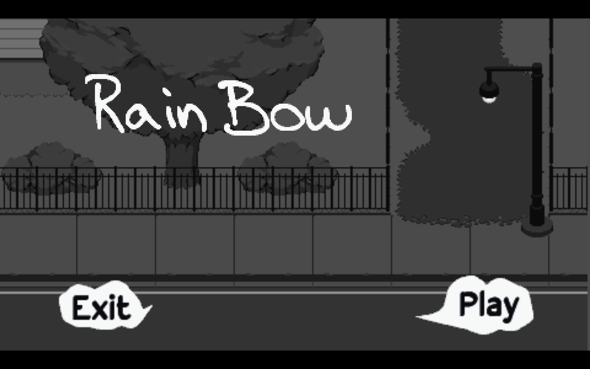
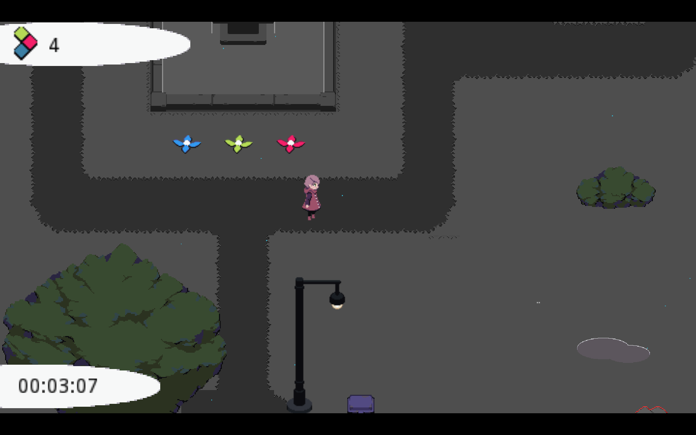

# RainBow
A game made for the [Games Den](https://sites.google.com/ualberta.ca/thegamesden/home) Summer Alberta Game Jam of 2020. Ran from Aug 14th, to Aug 16th.

Made using Godot 3

Made by:
* Boris Fleysher (Programming)
* Dawn McKnight (Programming)
* Eric Halina (Programming/Audio/Music)
* Jamie Powers (Art)
* Omer Ahmed (Programming)

You play as a child outside in the world after a rainstorm. All the rain has washed away the color in the world. Equipped with just your Rain Bow, go out there and spread some color and joy!

